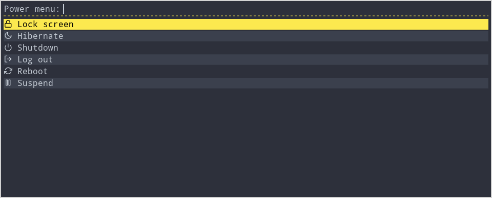

# rififi

Simple script to easily create rofi menus based on a configuration file.

Features:
  - one action is associated to each menu entry
  - confirmation can be asked before executing the action

## Usage

~~~
Usage: ./rififi.sh -f <CONFIGURATION_FILE> [-hdn] [SELECTED_ROFI_MENU_ENTRY]

Where:
  -f      path to CONFIGURATION_FILE
  -h      help
  -d      dry run
  -n      do not show symbols

Example:
  rofi -show powermenu -modi powermenu:"./rififi.sh -f ./rififi-power-menu.conf"
~~~

## Configuration file

All menu entries are declared and configured with the bash script CONFIGURATION_FILE.

Example:

~~~
#!/usr/bin/env bash

MENU_TITLE="Power menu"

MENU_ITEM_ID_ALL_ARRAY=( lockscreen switchuser logout suspend hibernate reboot shutdown )

MENU_ITEM_VISIBLE_ARRAY[lockscreen]="true"
MENU_ITEM_VISIBLE_ARRAY[switchuser]="false"
MENU_ITEM_VISIBLE_ARRAY[logout]="true"
MENU_ITEM_VISIBLE_ARRAY[suspend]="true"
MENU_ITEM_VISIBLE_ARRAY[hibernate]="true"
MENU_ITEM_VISIBLE_ARRAY[reboot]="true"
MENU_ITEM_VISIBLE_ARRAY[shutdown]="true"

MENU_ITEM_REQUEST_CONFIRMATION_ARRAY[lockscreen]="false"
MENU_ITEM_REQUEST_CONFIRMATION_ARRAY[switchuser]="false"
MENU_ITEM_REQUEST_CONFIRMATION_ARRAY[logout]="true"
MENU_ITEM_REQUEST_CONFIRMATION_ARRAY[suspend]="false"
MENU_ITEM_REQUEST_CONFIRMATION_ARRAY[hibernate]="false"
MENU_ITEM_REQUEST_CONFIRMATION_ARRAY[reboot]="true"
MENU_ITEM_REQUEST_CONFIRMATION_ARRAY[shutdown]="true"

MENU_ITEM_TEXT_ARRAY[lockscreen]="Lock screen"
MENU_ITEM_TEXT_ARRAY[switchuser]="Switch user"
MENU_ITEM_TEXT_ARRAY[logout]="Log out"
MENU_ITEM_TEXT_ARRAY[suspend]="Suspend"
MENU_ITEM_TEXT_ARRAY[hibernate]="Hibernate"
MENU_ITEM_TEXT_ARRAY[reboot]="Reboot"
MENU_ITEM_TEXT_ARRAY[shutdown]="Shutdown"

MENU_ITEM_SYMBOL_ARRAY[lockscreen]=""
MENU_ITEM_SYMBOL_ARRAY[switchuser]=""
MENU_ITEM_SYMBOL_ARRAY[logout]=""
MENU_ITEM_SYMBOL_ARRAY[suspend]=""
MENU_ITEM_SYMBOL_ARRAY[hibernate]=""
MENU_ITEM_SYMBOL_ARRAY[reboot]=""
MENU_ITEM_SYMBOL_ARRAY[shutdown]=""

MENU_ITEM_ACTION_ARRAY[lockscreen]="dm-tool lock"
MENU_ITEM_ACTION_ARRAY[switchuser]="dm-tool switch-to-greeter"
MENU_ITEM_ACTION_ARRAY[logout]="loginctl terminate-session ${XDG_SESSION_ID-}"
MENU_ITEM_ACTION_ARRAY[suspend]="systemctl suspend"
MENU_ITEM_ACTION_ARRAY[hibernate]="systemctl hibernate"
MENU_ITEM_ACTION_ARRAY[reboot]="systemctl reboot"
MENU_ITEM_ACTION_ARRAY[shutdown]="systemctl poweroff"
~~~

## Power menu

Tip: you can also start `xss-lock -- dm-tool lock &` via your `.xsessionrc` to lock the session at suspend and hibernate.

## Remmina connection

The script rewrites an index of the remmina connection files from `${HOME}/.local/share/remmina` if a change is detected in the files. It is written to be fast and not delay the appearance of the rofi menu if nothing changed in the remmina connnection files.

